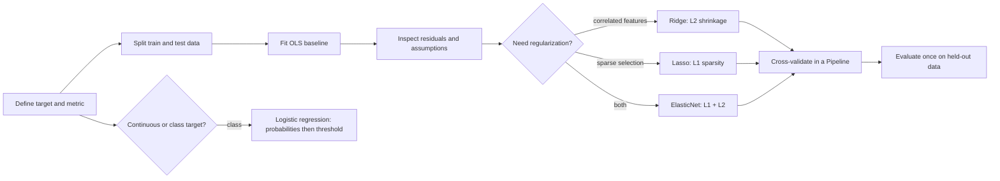

# Linear Models: Visual, Executable Learning Curriculum

A beginner-friendly linear-models project with runnable Python examples and an **executed Jupyter notebook curriculum**. Every lesson explains the concept before showing code and embedded visual output.

## Learning flow



## Start here

Install the pinned dependencies:

```bash
python3 -m pip install --user -r requirements.txt
```

Open the executed notebooks in [`notebooks/`](notebooks/):

| Notebook | Topic | Visual learning outcome |
|---|---|---|
| `00_linear_models_visual_curriculum.ipynb` | Complete overview | OLS → diagnostics → regularization → logistic flow |
| `01_ols_linear_regression.ipynb` | Ordinary least squares | Fit line, residuals, and held-out R² |
| `02_ridge_regression.ipynb` | Ridge / L2 | Coefficient shrinkage and alpha selection |
| `03_lasso_regression.ipynb` | Lasso / L1 | Sparsity and feature-selection caveats |
| `04_elasticnet.ipynb` | ElasticNet | L1/L2 balance for correlated predictors |
| `05_logistic_regression.ipynb` | Classification | Sigmoid, probabilities, threshold, confusion matrix |
| `06_assumptions_and_diagnostics.ipynb` | Diagnostics | Residual patterns and multicollinearity |

All notebooks were executed in the included `linear-models` kernel and store their charts directly in notebook outputs.

## Key practices

1. **Split before preprocessing.** Put `StandardScaler` and the estimator inside a `Pipeline` to avoid leakage.
2. **Use OLS as a baseline.** Check held-out performance and residual plots, not only training error.
3. **Ridge** shrinks all coefficients and is useful for correlated features.
4. **Lasso** can make coefficients zero, but this alone does not prove a feature is unimportant.
5. **ElasticNet** blends L1 selection and L2 stability.
6. **Logistic regression** models probabilities; labels require a threshold selected for the problem.

## Additional visual material

- [`VISUAL_LEARNING_GUIDE.md`](VISUAL_LEARNING_GUIDE.md) documents the visual foundations and evidence-based cautions.
- [`visual_foundations/`](visual_foundations/) contains generated high-resolution figures for OLS loss/R², cross-validation, overfitting, L1-vs-L2 geometry, regularization, logistic metrics, robust fitting, and Poisson GLMs.
- `linear_models/` contains educational from-scratch NumPy implementations of OLS, Ridge, Lasso, and binary logistic regression.

## Reproduce notebooks

```bash
jupyter notebook notebooks/
```

The project uses synthetic, deterministic examples for teaching. They demonstrate model behavior; they are not a substitute for domain-specific validation or causal analysis.
